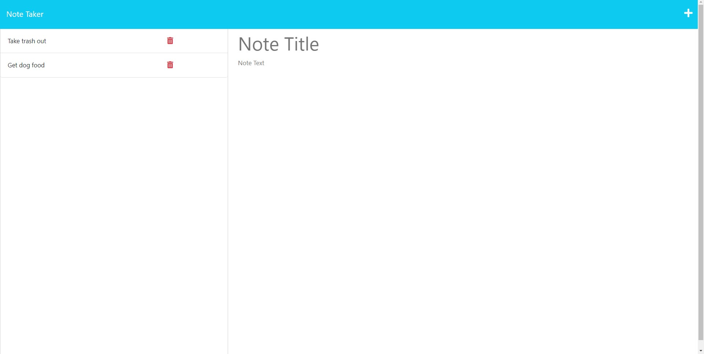

# Aaron's Note Taker
## Description
This is my Note Taking website. My motivation for this website was to have an easy way of being able to quickly take notes down while I'm in class listening to my instructor. I find it way easier to correct typos compared to having to erase the word on a paper and scrape away the eraser scraps, it's also wayy faster for me to type than write. It solves the time it takes to take notes the normal way, having to fix your pencil by either sharpening it, putting more lead in, erasing mistakes and throwing away the residue, and buying more paper. I learned how to code routes for my website. 
## Image of Application

## Credit
Assistance from Jorge Alcala